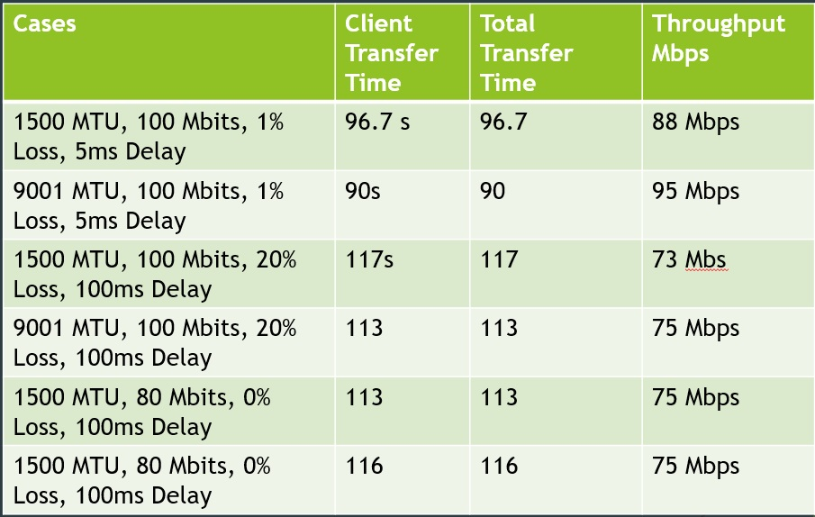

# Custom Fast and Reliable Protocol Design

## Problem

While TCP is effective, reliable, and relatively robust on the Internet, it doesn't always give us the best
throughput under every circumstance. In this section we design an UDP based file-transfer utility. The
design and implementation of the utility is such that it fulfills the following criteria:
- it must use IP (so it can be routed)
- it must transfer the file reliably (with no errors)
- it must be implemented with a command-line interface similar to scp.
The link speed of the sender and receiver is 100Mbps and the test file size is at least 1GBytes.

## Testing

1. The Delay (RTT) of 10ms with the Loss rate of 1% (bi-directional) set at router and link speed set
to 100Mbits/sec for server, client and router. - Case 1
2. The Delay (RTT) of 200ms with the Loss rate of 20% (bi-directional) set at router and link speed
set to 100Mbits/sec for server, client and router. - Case 2
3. Set link speed to 80 Mbits/sec and delay (RTT) to 200ms on with no drop at router and server,
client link speed set to 100 Mbits/sec. - Case 3

Run the above tests with MTU of 1500 and then with MTU of 9000. 

## Protocol Flowchart

 

 
 
Custom Fast and Reliable Protocol Flowchart

 

## Protocol Design

- Our custom file transfer application is based on UDP.
- We use an iterative approach to deal with packet loss in the link.
- We have used multi-threading along with multiple sockets to achieve maximum throughput.
- Our ACK packets contain the missing sequence numbers which are resent by the client.
- Client – 5 sending threads, 1 receiving thread
- Server – 5 receiving threads, 1 sending thread
- We have reserved the first 5 bytes in the packet for sequence numbers and done flag

## Multithreading

 

 
 
Threads used to implement Custom Fast and Reliable Protocol

 

## Result

 

 
 
Testing Results for Custom Fast and Reliable Protocol Flowchart

 

